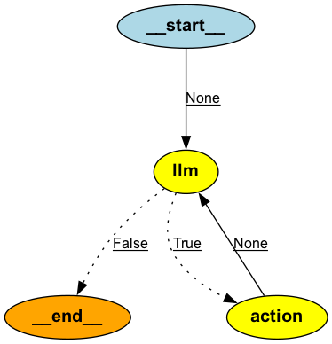

## Installation for Mac
The following steps are required to save graph rendering localing on the repository.

 Step 1. Follow instructions to install [brew](https://brew.sh) to install packages/tools that are not pre-installed on your laptop.
 Step 2. Run 
 ```brew 
 brew install graphviz
 ```
 Step 3. Per [PyGraphviz](https://pygraphviz.github.io/documentation/stable/install.html) run
 ```bash 
    pip install --config-settings="--global-option=build_ext" \
                    --config-settings="--global-option=-I$(brew --prefix graphviz)/include/" \
                    --config-settings="--global-option=-L$(brew --prefix graphviz)/lib/" \
                    pygraphviz
```

# LLM-Agents

## Simple Reach Agent

## LangGraph Agent

Visual of the simple Langgraph Agent utilizing a search tool that leverages the TavillySearch API.

